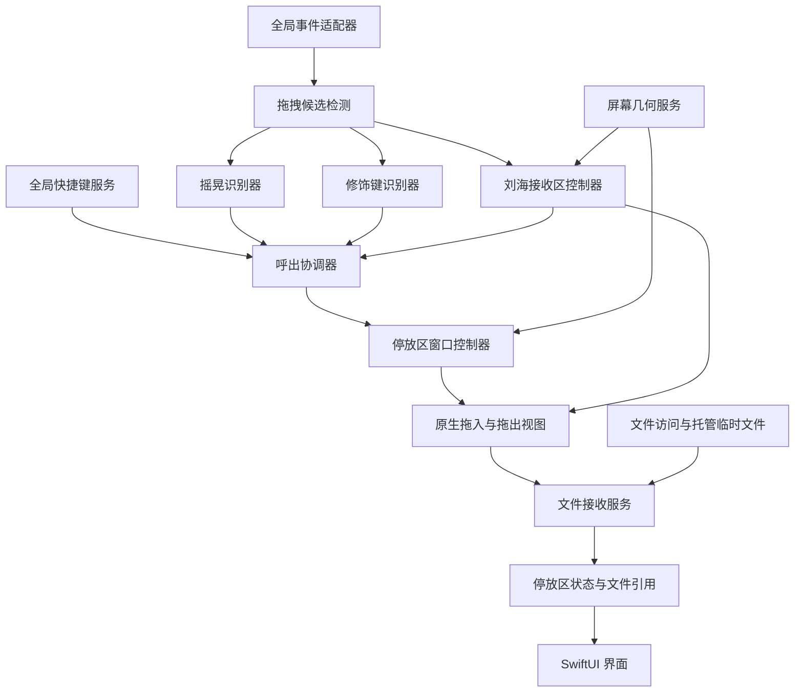

# Dropover 功能调研与 Layby 技术分析

调研日期：2026-09-11。目标系统：macOS 27。

本文只记录调研和技术设计，不表示功能已经实现或通过实机验证。配套实施安排见 [落地计划](./implementation-plan.md)。

## 1. 结论

Layby 适合采用 **AppKit 系统交互层 + SwiftUI 界面层 + 文件引用模型**：

- AppKit 负责跨应用输入观察、原生拖放、浮动窗口、屏幕坐标和全局快捷键。
- SwiftUI 负责停放区内容、设置和状态反馈，通过 `NSHostingView` 嵌入 AppKit 窗口。
- 已有文件暂存其 URL 和访问能力；真正投放后才读取文件信息。临时停放不改变原文件位置。
- 摇晃、修饰键拖拽、刘海拖入和全局快捷键都进入一个呼出协调器，复用同一接收与展示流程。

最大技术风险是“在自己的窗口之外可靠识别文件拖拽”，其次是刘海区域的窗口命中、全屏显示，以及沙盒内的文件转交。这些应先做原型验证，再进入完整界面开发。

**证据边界：**本次查阅的 Dropover 官方资料公开了产品行为，没有公开可用于确认内部语言、模块结构、事件监听方案或算法的源码/架构文档。下文会明确区分官方事实、Apple API 事实和 Layby 的工程设计；不能将推导出的 AppKit 架构称为 Dropover 的已证实内部实现。

## 2. Dropover 官方行为

| 能力 | 已查证行为 | Layby 本期范围 |
| --- | --- | --- |
| 临时停放 | 用浮动 shelf 收集内容，再拖向目标位置 | 核心闭环 |
| 摇晃呼出 | 摇晃指针呼出 shelf；可调灵敏度、排除应用 | 实现文件拖拽中的摇晃呼出 |
| 全局快捷键 | 可配置；新建空 shelf 默认 `⌥⇧Space` | 独立全局呼出入口，默认组合另定 |
| 刘海 | 支持的 MacBook 可把内容投放到刘海，随后创建带内容的 shelf | 拖入时先呼出，松手时入库 |
| 文件语义 | Finder 文件放入 shelf 仅保存引用，不复制、不移动 | 保持引用暂存 |
| 内容类型 | 文件夹、文件、图片、链接、文本等 | 首期文件/文件夹，随后文件承诺 |
| 扩展能力 | 预览、分享、文件操作、固定/最近 shelf、自动化等 | 本期不展开 |

产品能力依据：[Dropover 首页](https://dropoverapp.com/)。文件引用语义依据：[官方 FAQ](https://dropoverapp.com/faq)。快捷键依据：[Keyboard shortcuts](https://dropoverapp.com/kb/shelf-keyboard-shortcuts)。刘海行为依据：[4.11.0 发布说明](https://dropoverapp.com/whats-new/4.11.0)。

### 2.1 两处需要明确的产品差异

**刘海触发时机：**官方说明是把内容放到刘海后创建 shelf。Layby 按本项目需求设计为“拖入刘海感应区后先展开可投放区域，松手后加入文件”。拖入只展示，不能自动把内容加入列表。这样支持用户看见目标后再决定是否投放。官方行为可参考 [Drop to notch](https://dropoverapp.com/tips)。

**按住快捷键并拖拽：**本次查阅的官方页面未找到足够明确的、现行“按住某个修饰键拖拽呼出”的规则，因此不写成 Dropover 已确认的默认行为。Layby 独立设计此入口：默认按住 `Shift` 拖拽；设置中可改修饰键。完整组合键则由全局快捷键入口处理，按下组合键时即使正在拖拽，也能呼出目标。

这里的 `Shift` 是 Layby 的初始设计选择，不是对 Dropover 默认设置的断言。

## 3. 当前项目基线

本节来自本地文件和只读工具检查。

| 项目 | 当前状态 | 对实施的影响 |
| --- | --- | --- |
| `Layby/MyApp.swift` | SwiftUI `App` + `WindowGroup` | 需要增加应用生命周期和菜单栏入口 |
| `Layby/ContentView.swift` | Hello World、Preview、Playground | 尚无可复用的停放区业务 |
| Deployment target | `MACOSX_DEPLOYMENT_TARGET = 27.0` | 按 macOS 27 验证 |
| 平台 | `iphoneos iphonesimulator macosx xros xrsimulator` | 本期面向 macOS，落地时收敛目标配置 |
| 沙盒 | `ENABLE_APP_SANDBOX = YES` | 优先保持沙盒，先验证跨应用能力 |
| 文件权限 | `ENABLE_USER_SELECTED_FILES = readonly` | 适合引用/读取；不能直接承诺任意写入、移动能力 |
| 并发 | 默认 `MainActor`，Approachable Concurrency 开启 | AppKit 保持主线程，后台工作显式隔离 |
| Swift 语言模式 | `SWIFT_VERSION = 5.0` | 不把编译器版本误当语言模式；本期不顺带迁移 |
| 测试与依赖 | 未发现测试 target 或第三方包 | 后续增加有针对性的算法测试与系统交互验收 |

本地系统报告 macOS 27.0（26A428）；Command Line Tools 所带 SDK 为 27.0。默认 `xcode-select` 指向 Command Line Tools，直接调用 `xcodebuild` 会失败。通过临时 `DEVELOPER_DIR=/Applications/Xcode.app/Contents/Developer` 查询，已安装 Xcode 报告 26.6（17F113），其默认 macOS SDK 为 26.5。

因此“系统是 27”“CLT 有 27 SDK”不等于“当前 Xcode 已配置为完整的 27 SDK 工具链”。实施前需统一匹配工具链，记录实际编译器、SDK 和运行系统。本次没有构建、切换全局开发者目录或修改工程配置。

调研开始时已有 `xcuserdata/.../xcschememanagement.plist` 未提交变更，应保留。当前仓库及检查过的父目录未发现 `AGENTS.md`。

## 4. 原理拆解：从系统能力推导可实现架构

### 4.1 文件不必先复制到应用目录

已有文件通过原生拖放传递文件 URL；停放区保留引用并展示元数据，用户再次拖出时重新提供文件 URL。仅在目标执行复制/移动、或者源应用通过文件承诺生成文件时，才发生相应磁盘操作。

这能解释大型文件可以快速进入停放区的产品体验。它不代表引用永久有效：原文件删除、移动、卷卸载、云文件离线、授权过期，都可能导致引用暂时或永久不可用。

Dropover 的引用行为是官方事实；Layby 如何维护引用、处理错误和释放访问能力是本项目的设计。[官方 FAQ](https://dropoverapp.com/faq)

### 4.2 全局鼠标运动不等于系统文件拖拽

`NSEvent.addGlobalMonitorForEvents` 可以观察发往其他应用的事件，不负责拦截或修改事件，也不覆盖本应用事件。本应用需另接 local monitor 或原生拖拽回调。Apple 还说明 local monitor 不覆盖所有嵌套 tracking loop 中消耗的事件。因此不能简单认为 global + local 就能完整获知每次拖拽的开始和结束。[Monitoring Events](https://developer.apple.com/library/archive/documentation/Cocoa/Conceptual/EventOverview/MonitoringEvents/MonitoringEvents.html)

尤其要区分：

1. `leftMouseDragged`：鼠标按下后的运动，可能是移动窗口、框选、拖动滑块。
2. 拖拽候选状态：运动、按键状态与拖放元数据共同提供的推测。
3. `NSDraggingInfo`：指针真正进入本应用注册的接收区域后，AppKit 提供的实际拖拽信息。

Apple 没有在本次查阅的 AppKit 文档中提供可供任意第三方应用订阅的、完整的跨进程“文件拖拽开始/结束”通知。需要组合观察信号，但应把启发式判断留在呼出层。

### 4.3 固定 `.drag` pasteboard 只能作候选信号

可研究读取 `NSPasteboard(name: .drag)` 的 `changeCount` 与类型信息，辅助识别新一轮文件拖拽，但有两个限制：

- 上次拖拽结束后数据可能仍在，非空不代表正在拖拽。
- Apple 明确指出，跨进程拖拽不保证使用标准 drag pasteboard；实际接收时必须取 `sender.draggingPasteboard`。[Dragging Destinations](https://developer.apple.com/library/archive/documentation/Cocoa/Conceptual/DragandDrop/Concepts/dragdestination.html)

因此，不能把“左键按住 + `.drag` 有 URL”作为已证明的可靠检测算法。`changeCount` 也不是全局拖拽会话 ID。需要短期候选 token、鼠标按压周期、观察到的更新、取消与松手复位，并允许漏识别时走快捷键。

检测阶段最多检查类型/变化等轻量信号；不解析文件路径、不读取文件内容、不提前兑现 promise。现代 pasteboard 还存在访问控制，是否会触发提示、在目标系统能读到哪些元数据都列入原型验证，不能把 `.general` 当替代数据源。[NSPasteboard](https://developer.apple.com/documentation/AppKit/NSPasteboard?language=objc)

### 4.4 真正接收应使用 AppKit 拖放协议

让接收视图注册文件 URL 和所支持的 promise 类型，实现 `draggingEntered`、`draggingUpdated`、`draggingExited`、`prepareForDragOperation`、`performDragOperation`、`concludeDragOperation` 等回调。只有合法投放才进入入库流程。[Dragging Destinations](https://developer.apple.com/library/archive/documentation/Cocoa/Conceptual/DragandDrop/Concepts/dragdestination.html)

Layby 应使用现代 `NSDraggingItem`、`NSDraggingSession` 与 URL 对象组织拖出，每个 pasteboard item 对应一个 dragging item，不采用旧的文件名数组拖放 API。[AppKit 拖放迁移说明](https://developer.apple.com/documentation/macos-release-notes/appkit-release-notes-for-macos-10_14)

### 4.5 刘海是屏幕几何与窗口命中问题

`NSScreen.safeAreaInsets`、`auxiliaryTopLeftArea`、`auxiliaryTopRightArea` 提供顶部遮挡和两侧可用区域信息。已在本地 macOS 27 SDK 的 `NSScreen.h` 核对这些公开属性存在；它们不是专用的刘海拖放回调。

Layby 可以据此计算顶部中央区域，并在其下方可显示的屏幕区域放置原生拖放视图。物理摄像头遮挡处不能绘制可见界面，指针抵达逻辑刘海范围也不保证自定义窗口能收到投放，必须实测。

实现不能只用 `screen.frame.maxY - visibleFrame.maxY` 推测刘海高度，因为普通菜单栏、自动隐藏菜单栏和显示模式也会影响可用区域。应结合安全区和两侧区域，无法确认刘海时关闭该入口或启用明确标注的顶部感应区。

## 5. Layby 推荐模块结构

| 模块 | 职责 | 不应承担的职责 |
| --- | --- | --- |
| `AppCoordinator` | 生命周期、服务装配、菜单栏和设置 | 摇晃数学计算 |
| `DragObservationService` | 规范化事件、候选状态、取消/恢复 | 提前读取拖拽文件内容 |
| `ShakeRecognizer` | 输入轨迹，输出是否满足阈值 | 直接创建窗口 |
| `ModifierDragRecognizer` | 拖拽状态内检测配置修饰键 | 捕获普通文本输入 |
| `GlobalHotKeyService` | 注册、注销、修改组合键 | 全局键盘记录 |
| `ActivationCoordinator` | 合并入口、一次拖拽只呼出一次、定位策略 | 文件读写 |
| `ScreenGeometryService` | 显示器身份、坐标转换、刘海几何 | 硬编码某型号刘海尺寸 |
| `NotchDropController` | 小范围接收区域与展开时机 | 全屏透明输入覆盖层 |
| `ShelfWindowController` | `NSPanel` 生命周期、可见性、焦点 | 数据持久化 |
| `ShelfDropView` / `ShelfDragSourceView` | AppKit 拖放协议、操作协商 | 删除原文件 |
| `ShelfStore` | 条目、选择、加载、失败、隐藏状态 | 直接操作 TCC |
| `FileAccessService` / `ManagedFileStore` | 访问租约、承诺文件生成与清理 | 扫描用户整个磁盘 |

首期一个停放区实例，可持续追加文件；按 2026-09-12 的产品调整，关闭后清空条目，下次呼出为空。多 shelf、固定和跨启动恢复留出模型扩展点，但不作为四种入口的前置条件。

## 6. 关键技术选择

### 6.1 事件观察与权限

优先原型：用 `NSEvent` 观察必要鼠标事件，并读取拖拽事件携带的 `modifierFlags`。全局键盘类事件有额外信任要求，不能因为 mouse monitor 可用，就假定 `flagsChanged`/Esc 也总是可用。[addGlobalMonitorForEvents](https://developer.apple.com/documentation/appkit/nsevent/addglobalmonitorforevents%28matching%3Ahandler%3A%29)

如目标系统下存在影响四种入口的事件缺口，可评估 `CGEvent.tapCreate` 的 `.listenOnly` 后端，限制事件 mask，并处理创建失败、超时停用和重新启用。只读 event tap 与可修改事件的 tap 权限不同：前者涉及输入监控，后者涉及辅助功能。不得笼统要求用户把两项都打开。[Advances in macOS Security](https://developer.apple.com/videos/play/wwdc2019/701/)

`CGPreflightListenEventAccess` / `CGRequestListenEventAccess` 用于对应后端的能力检测/请求；辅助功能状态只在实际使用需要该信任的 API 时检测。当前设计不需要屏幕录制、Apple Events 自动化或全磁盘访问。权限、沙盒兼容与发行方式是不同维度；授权 TCC 也不代表所有沙盒调用就会成功。

### 6.2 浮窗

使用 `NSPanel` 子类，在创建时确定 `.borderless` / `.nonactivatingPanel` 等样式，嵌入 SwiftUI。候选配置包括 `.floating`、`hidesOnDeactivate = false`、适当的 `collectionBehavior`。属性及行为定义已从本地 `NSPanel.h`、`NSWindow.h` 核对。

拖拽触发时只显示窗口，不调用应用激活或强制成为 key window 的流程。用户明确点击面板或非拖拽快捷键调用时，才按需要使面板接收键盘输入。不能将 `canBecomeKey = false` 作为永久设置，否则键盘导航无法正常工作。

`.canJoinAllSpaces`、`.fullScreenAuxiliary` 是实验候选，不能保证所有全屏应用、Stage Manager 和系统界面都可覆盖。普通停放区采用最低足够层级，刘海接收区如需更高层级则单独验证，禁止常驻最高层级遮挡系统菜单。

### 6.3 全局快捷键

用可替换的 `GlobalHotKeyService` 封装系统注册 API，首选评估 `RegisterEventHotKey`。本地 SDK `CarbonEvents.h` 仍声明该 API；必须在目标系统验证可注册性、tracking loop 中回调和键盘布局行为。

计划默认 `⌃⌥Space`，允许修改；不宣称不存在系统或第三方冲突。使用 exclusive 选项检测可识别的注册冲突，处理返回状态码；仍需实际试按验证，因为系统保留键和部分第三方实现不能靠注册结果完整发现。

SwiftUI `.keyboardShortcut` 用于应用内命令，不能独自实现后台全局呼出。也不通过持续监听所有 `keyDown` 替代注册快捷键。

### 6.4 文件模型与拖放语义

建议 `ShelfItem` 保存稳定 item ID、显示名、文件 URL、来源类型、加载/可用状态；安全作用域访问由独立租约管理。去重优先采用可获得的卷/文件标识，退化为规范化 URL；不按文件名去重，不解析符号链接来改变用户选择的对象。

已有本地文件仅保留引用。文件承诺由 `NSFilePromiseReceiver` 在投放后异步写入应用容器下的唯一目录，每个条目显示等待、成功或失败。一个 receiver 可能代表多个文件，不能假设永远一对一。[NSFilePromiseReceiver](https://developer.apple.com/documentation/appkit/nsfilepromisereceiver?language=_9)

入站仅声明本应用真正支持且与 `draggingSourceOperationMask` 相交的操作。初期优先以 `.copy` 完成引用接收，不返回 `.move` 诱使来源删除原件；源只允许 move 时拒绝并提示。这里的 `.copy` 是拖放协议中的协商结果，对已存在文件的暂存仍不复制文件字节。[draggingSourceOperationMask](https://developer.apple.com/documentation/appkit/nsdragginginfo/draggingsourceoperationmask)

出站首期承诺“可复制到 Finder 或交给兼容应用”，仅广告 `.copy`；完整 Finder 移动语义另设验收门槛。将 mask 改为 `.move` 并不会自动完成所有文件系统移动责任；尤其当前只有用户选中文件的只读权限，不能把它包装成已支持无损移动。若后续扩展移动，需单独设计权限、源/目的端责任、跨卷行为和取消恢复。

拖出结束回调只表示接收端协商结果，不能当作所有目标异步复制已落盘的证明。保守默认保留条目，失败/取消一定保留。托管 promise 文件不能在拖拽结束的一瞬间清理。

### 6.5 沙盒文件访问

真正的用户投放是取得特定文件访问能力的入口，不能把拖入前的全局观察视为同等授权。[Apple 关于拖放与用户意图](https://developer.apple.com/videos/play/wwdc2019/701/)

已有拖放授权与解析 security-scoped bookmark 后的授权需要区分：不是对任意 URL 调用 `startAccessingSecurityScopedResource()` 就能获得权限。需要 scope 的 URL 成功 start 后，必须对应 stop；普通已授权 URL 返回 false 时也不能直接等同于文件必然不可读，应依据其来源与实际读取结果处理。[NSURL 访问说明](https://developer.apple.com/documentation/Foundation/NSURL/startAccessingSecurityScopedResource%28%29?changes=_6)

首期不恢复跨启动停放区，避免把书签与数据库提前变成必需复杂度。若增加恢复，使用 security-scoped bookmarks、对应 entitlement、stale 刷新与重新选择文件流程；普通路径字符串不够。访问租约须覆盖缩略图、promise、拖出实际使用期，最后一个使用者结束才释放。

## 7. 需要先验证的事实

| 问题 | 验证方法 | 失败时的处理 |
| --- | --- | --- |
| Finder 外部拖拽能否稳定观测 | 鼠标、触控板、三指拖移；记录事件与候选状态 | 更换观察后端；明确应用兼容范围 |
| 标准 drag pasteboard 是否可读且足够及时 | 仅记录类型/变化；验证权限提示和非标准源 | 不读取内容绕过限制；快捷键及真实接收区继续可用 |
| 新浮窗能否在同一次拖拽中接收 | 摇晃后继续移动并松手 | 调整位置和呈现顺序；不得重发模拟鼠标事件 |
| 按住 Shift 能否同时覆盖先按键和后按键 | 两种顺序及静止时按键 | 在拖拽候选期间短暂采样修饰键状态 |
| 刘海附近能否及时捕获高速进入和投放 | 快慢拖入、自动隐藏菜单栏、不同缩放 | 加可见的刘海下方接收带；必要时有限常驻接收视图 |
| 沙盒 URL 能否可靠转交目标应用 | 本地、只读、外置卷、云文件、沙盒接收端 | 调整数据提供方式；不虚报 move 支持 |
| 热键在拖拽 tracking loop 中是否可用 | 按住鼠标时触发完整组合键 | 使用经验证的服务后端并记录限制 |
| 全屏/多显示器下窗口策略 | 指针所在屏幕、不同 Space 和显示器排列 | 给出明确支持矩阵，修正层级/定位 |

这些是未来开发阶段的验证门槛，本次没有执行相关原型。

## 8. 资料索引与可信度

直接产品事实以 [Dropover 官方首页](https://dropoverapp.com/)、[FAQ](https://dropoverapp.com/faq)、[快捷键文档](https://dropoverapp.com/kb/shelf-keyboard-shortcuts)、[刘海发布说明](https://dropoverapp.com/whats-new/4.11.0)、[技巧文档](https://dropoverapp.com/tips) 为准。不同年代说明可能描述不同版本，本文优先采用现行行为，并标明历史发布说明的用途。

系统接口事实以以上段落链接的 Apple 文档和本机 SDK 头文件为依据。部分 Apple 现代网页仅返回 JavaScript 占位页，相关窗口/屏幕属性以本地 macOS 27 SDK 的 `AppKit.framework/Headers/NSScreen.h`、`NSPanel.h`、`NSWindow.h` 补充核验；拖放协议以 `NSDragging.h` 补充核验；快捷键以 `Carbon.framework/.../CarbonEvents.h` 补充核验。

历史拖放文档仅用于跨进程 pasteboard 与回调生命周期原则，不沿用其中过时的 Java、旧拖放方法或旧修饰键表。操作 mask 依据现行 Apple 文档；macOS 27 行为仍需实测。

搜索结果中出现的同名 GitHub 组织、第三方下载站和未经证实的源码镜像，没有用作 Dropover 内部架构的证据。
