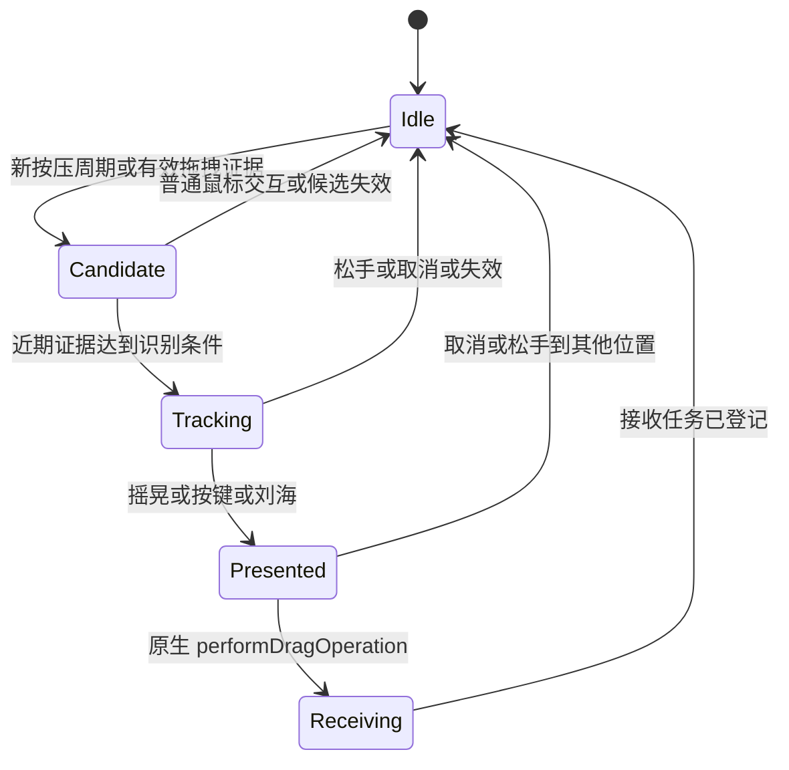

# Layby 临时文件停放区落地计划

日期：2026-09-11。状态：**设计完成，尚未开始实施**。目标系统：macOS 27。

调研依据、官方行为和技术不确定性见 [Dropover 调研与架构分析](./dropover-research.md)。本文件中的参数、默认键位和阶段工期均为计划值，不是实测结果。

## 1. 本期目标与范围

实现完整闭环：从 Finder 等应用拖出文件，通过四种方式之一呼出停放区，松手暂存，再拖出至 Finder 或兼容应用。

| 编号 | 用户要求 | 计划交互 |
| --- | --- | --- |
| R1 | 拖拽摇晃文件呼出 | 拖拽候选成立后识别短时间多次反向运动，在指针附近展示停放区 |
| R2 | 按住快捷键 + 拖拽呼出 | 默认按住 Shift；支持先按键后拖拽、拖拽中再按键。完整组合键在拖拽中也走 R4 |
| R3 | 拖拽文件到刘海呼出 | 进入感应区短暂停留即展开；快速松手也可由原生接收区直接接收 |
| R4 | 按下快捷键呼出 | 默认 `⌃⌥Space`，后台生效；显示空停放区或已有内容 |

本期提供一个可追加内容的浮动停放区、文件/文件夹多选拖入拖出、单项移除、清空、隐藏、设置、菜单栏入口和错误提示。关闭按钮、Esc、⌘W 和原生关闭统一清空本次停放内容，下次呼出为空；清空和移除不删除源文件。应用托管的临时副本在写入和访问租约释放后删除。应用退出后不恢复列表。

文件承诺作为兼容性阶段纳入本计划，完成后才宣称支持对应来源的“导出式拖拽”。链接、纯文本、网页图片、云上传、压缩/改名、固定 shelf、历史恢复、分享扩展不属于本期。

首期拖出支持复制/交给目标应用读取；完整 Finder 移动语义暂不承诺，原因是当前只读沙盒配置与移动责任需要额外设计。四种呼出方式不依赖移动功能。

## 2. 统一交互规则

### 2.1 显示与位置

- R1/R2：优先在指针右下方展示，离指针留约 28 pt 间距；放不下时翻转方向，再限制在所在屏幕可用矩形内。展示后不持续追随指针，以免目标难以投放。
- R3：在该屏幕刘海下方展示，接收区域与刘海下方接收带连通。已显示面板在拖拽期间不突然迁移，刘海接收区仍可把内容加入同一列表。
- R4：停放区可见时提升可见性、需要时转移到当前屏幕；隐藏时在指针所在屏幕重新展示。按住不连发创建，不清空已有条目。
- 所有拖拽中的呼出不激活应用、不切换 Space、不抢来源应用焦点。非拖拽快捷键调用可使面板获得键盘操作能力。
- 本次拖拽呼出的空面板在取消/结束后延迟约 600 ms 隐藏；已有内容、已成功接收 promise 或手动呼出的空面板不自动隐藏。

### 2.2 去重与入口优先级

同一拖拽最多消费一次 `ActivationRequest`。同一轮评估中优先级为：用户明确快捷键 → 刘海 → 修饰键 → 摇晃。异步到达的更高优先级请求不再移动已展示面板，防止目标在指针前跳动。

原生接收区用 `draggingSequenceNumber` 去重真实投放；外部候选阶段只分配本地 observation token，不冒充系统会话 ID。两个阶段在进入接收区时关联。不得仅靠固定冷却时间防止重复添加。

### 2.3 内容与失败

同一文件重复拖入默认不产生重复条目，不同路径下的同名文件可并存。混合拖入时加入支持的项目并提示其余项目被跳过。加载失败展示具体条目状态，不能让一项失败清空整批。

外部拖出取消、目标拒绝或按 Esc 后保留原列表。内部拖拽用于重排/选择时不启动新的全局呼出。首期对已暂存文件的拖出也保持列表，用户主动清理。

## 3. 四种入口的详细方案

### 3.1 R1：摇晃识别

输入为单调时间戳、统一屏幕坐标中的点、按钮/修饰键状态和拖拽候选强度。使用有界环形缓冲区保存最近约 500 ms 的轨迹，采用累计位移而非每个高频事件的正负号判断方向变化。

初始中档参数建议：

| 参数 | 初始值 | 目的 |
| --- | --- | --- |
| 时间窗 | 500 ms | 判断连续动作 |
| 有效半程位移 | 14 pt | 避免把手抖当作反向 |
| 主轴有效反向次数 | 至少 3 次 | 排除单次甩动 |
| 累计路径 | 至少 90 pt | 排除静止微颤 |
| 净位移 / 路径长度 | 不高于 0.5 | 偏向往返运动 |
| 触发后的短冷却 | 800 ms | 抑制结束边缘噪声，另有会话锁 |

在窗口内用主轴投影或先验证水平/垂直双轴策略，记录清楚最终数学定义。低中高灵敏度采用整组阈值，避免仅降低反向次数使误触增多。不同采样率通过时间和距离归一化，不能按事件数量调灵敏度。

只在近期拖拽证据成立时运行，不对普通鼠标移动运行。检测必须排除窗口移动、框选、拖动滑块和已结束后残留 pasteboard。Esc 后若没有可靠键盘事件，不可仅凭仍按下的鼠标继续保持“已确认拖拽”；应失效本轮候选并要求新的有效证据。具体取消识别是 P0 验证项。

### 3.2 R2：修饰键 + 拖拽

默认 `Shift`，设置中提供常用修饰键选择。保存的是符号化修饰键配置，而不是某个鼠标回调的瞬时状态。

两条触发路径均需要拖拽候选：

1. 先按住键再开始拖拽：首次有效候选立即评估当前修饰键。
2. 已经拖拽再按住键：从拖拽事件 flags、可用的 flagsChanged 或候选期间的短时状态采样更新。

短时采样如确有必要采用约 30 Hz，仅在候选期间开启，放在能覆盖 event-tracking 的运行循环模式；静止按键也应在约 100 ms 内响应。源事件保留，不修改 flags，也不模拟松开键。

`Option` / `Command` 会影响源应用的复制/移动协商，因此不作为默认组合。用户自定义后仍遵守源操作 mask，必要时提示松开该键再投放。`Shift` 在来源应用里也可能有自定义语义，需在测试矩阵中验证。

“完整组合键 + 拖拽”统一调用 R4 的注册热键服务；不扩大为任意普通字母的持续全局监听。

### 3.3 R3：刘海触发

按每个 `NSScreen` 独立计算几何。候选计算为：在同一屏幕全局坐标中，用左侧辅助区域的右边界和右侧辅助区域的左边界夹出中央缺口，顶部高度由 `safeAreaInsets.top` 约束；若两侧区域为空或几何矛盾，则不认为存在刘海。此计算是待验证的几何策略，不能把某一机型固定宽高用于所有屏幕。

设计三个区域：

- **接近区**：围绕刘海附近的较大判定区，只用于提前准备，不拦截投放。
- **接收带**：刘海下方可见区域的小型 `NSView` 拖放目标，建议向下扩展约 20–32 pt。
- **展开区**：停放区主体，位于物理遮挡以下；与接收带衔接，提供连续可投放路径。

原型先验证“拖拽候选出现时提前显示小型接收带”的方案，不能等进入刘海后才创建接收窗口。进入接收带的原生 `draggingEntered` 才是内容类型与实际拖拽的权威验证；正常悬停约 150 ms 后展开，离开约 250 ms 后收起未使用预览。快速松手由接收带直接接收，再展开显示内容。

若候选启用过晚或无法覆盖非标准 pasteboard 源，则评估仅在刘海下方保留有限面积的真实接收视图。该备选必须证明不会影响正常菜单栏点击；若无法同时满足，记录限制并继续改进，不能用全屏透明窗口掩盖问题。

视觉提示层可忽略鼠标事件，真正接收层必须能参与命中。不得把整个接收窗口设为 `ignoresMouseEvents = true`，也不能假定完全透明窗口必然参与拖拽命中。

无刘海显示器默认不启用此入口；可选“屏幕顶部中央感应区”作为单独设置，名称应表明是替代入口。外接屏、合盖、镜像/缩放、屏幕插拔后重算几何。多屏排列可有负坐标，混用 CoreGraphics 与 AppKit 时须集中转换并测试。

### 3.4 R4：独立全局快捷键

默认 `⌃⌥Space`，注册成功后方可在设置中显示为可用。修改时避免留下两份注册，失败可恢复原组合；禁用和服务销毁时注销。忽略按键重复，一次按下只发一个请求。

无拖拽时显示停放区，不读取剪贴板、不抓取 Finder 当前选择；有拖拽时只展示目标，原始拖拽会话继续由源应用持有。全局热键在应用不活跃时和 drag tracking 中分别验证。

提供菜单栏“显示停放区”作为直接入口。用户拒绝输入观察权限时，能够注册的热键和手动打开后拖放仍需可用，但这不等于 R1/R2 已完成。

## 4. 状态机与入库时序



这个状态机描述一次外部拖拽的观察生命周期，不是面板生命周期，也不等于系统的拖拽会话状态。`Receiving` 登记异步任务后，观察器可回到 Idle，条目继续处于 loading。R4 不依赖 Tracking，直接向窗口发显示请求。

面板另有 `hidden / empty / populated` 状态；条目另有 `loading / ready / unavailable / failed` 状态。避免一个庞大枚举承担所有组合。

标准时序：

1. 事件观察形成候选；触发器发出请求。
2. 呼出协调器去重，确定屏幕和位置；展示可接收的面板。
3. `draggingEntered/Updated` 校验真实 pasteboard 类型及操作 mask，显示合法/拒绝提示。
4. `performDragOperation` 从 `sender.draggingPasteboard` 读取支持的数据表示，分配本次导入 ID。
5. 现有 URL 建立引用与访问租约；promise 创建等待条目并启动生成任务。
6. 成功后追加条目，异步生成缩略图；失败回传到具体条目。
7. 只有本次导入登记成功才返回接受结果。观察到的 mouseUp 不得抢先销毁正在执行投放的窗口或状态。

## 5. 文件接收、资源与线程

`@MainActor` 管理 AppKit 对象、协调器和可观察 UI 状态。事件回调只做轻量采样，不读文件、不生成缩略图。磁盘、云文件下载和 promise 处理走受限队列/独立 actor，结果再回主线程。

原型确认具体对象的线程要求；不把 `NSEvent`、`NSDraggingInfo`、`NSWindow` 随意送进 detached task。提取可安全传递的值，封装异步结果。当前默认 actor isolation 需要明确为纯算法与后台服务选择适当隔离策略。

资源规则：

- 现有文件仅引用，不递归遍历文件夹，不预读大型文件。
- 缩略图惰性加载，缓存有界；先显示图标与名称。慢速网络卷不阻塞 UI。
- promise 写入容器内唯一临时目录，支持多文件、同名隔离、部分失败与取消。
- 清理只作用于本应用拥有的托管文件；用户原件永不进入清理队列。
- 清空时先取消/隔离导入任务；晚到回调核对导入 ID 和 store generation，不能让文件重新出现。
- promise 输出目录在回调完成前不得删除；若已清空，晚到产物进入待清理集合。
- 拖出中的文件及仍有访问租约的文件不能被清理。拖出结束不等于目标消费已结束，应保留至经过验证的安全窗口；必要时以文件承诺导出托管内容。
- 外置卷移除、源文件删除、授权失效时标记不可用，重新验证后才恢复拖出。

日志使用 `Logger`，记录入口、状态迁移、耗时、错误域与码、匿名计数；默认不记录路径、文件内容或普通键盘输入。

## 6. 计划目录

以下目录仅作后续实施建议，本次不创建 Swift 文件。

```text
Layby/
  App/                 AppCoordinator、AppDelegate、菜单栏入口
  Activation/          候选检测、摇晃、修饰键、热键、呼出协调
  Shelf/               ShelfStore、ShelfItem、SwiftUI 内容
  Platform/            NSPanel、AppKit 拖入拖出、屏幕、刘海
  Files/               文件引用、访问租约、promise、托管文件
  Settings/            四个入口开关、快捷键、灵敏度、权限状态
  Support/             时钟抽象、结构化日志
LaybyTests/            轨迹回放、状态机、几何、去重与导入生命周期
docs/                  调研、计划、后续验证记录
```

无需为本期引入数据库、网络服务或通用插件框架。第三方快捷键库如后续确有价值，应先核查许可证、维护状态与 macOS 27 兼容性，再通过服务接口替换。

## 7. 分阶段实施与通过门槛

执行顺序为 `P0 → P1 → P2 → P3 → P4 → P5`。工期为单人有效开发时间估计，不包含等待硬件/系统升级或发行审核；P0 后重估。

| 阶段 | 预计时间 | 工作与交付 | 必须通过的门槛 |
| --- | --- | --- | --- |
| P0：技术验证 | 2–3 天 | 匹配工具链；最小事件/拖放/热键/刘海原型；记录权限与来源矩阵 | 证明同次外部拖拽可呼出并投放；识别主要误触来源；刘海实机成功；确定沙盒后端 |
| P1：最小闭环 | 2–3 天 | macOS 配置、菜单栏、NSPanel、文件引用模型、原生拖入/复制拖出、R4 | Finder 多文件/文件夹可进可出；不移动源文件；后台快捷键可用；取消不丢条目 |
| P2：手势入口 | 2–3 天 | R1/R2、去重状态机、灵敏度、排除应用 | 摇晃和两种按键时序可用；普通运动/框选不误触；连续拖拽不重复呼出 |
| P3：刘海入口 | 2–3 天 | 几何服务、接收带、悬停展开、跨屏处理 | 慢拖和快速投放成功；菜单栏可正常点击；全屏/多屏结果明确 |
| P4：兼容与可靠性 | 2–3 天 | promise、权限拒绝/撤销、不可用文件、清理竞态、设置 | 至少两个真实 promise 来源通过；部分失败不影响其他项；清空后晚回调不复活条目 |
| P5：系统验收 | 1–2 天 | 自动化回放、人工系统矩阵、性能、可访问性、文档 | 四种入口逐条验收，已知限制可复现，无未处理的数据丢失缺陷 |

预计合计约 11–17 个开发日；系统输入或刘海命中若出现未预期限制，需要追加验证时间，不能把估算作为交付承诺。

### P0 具体实验记录

每个实验记录系统 build、SDK、签名/沙盒配置、权限状态、硬件/显示器、输入设备、来源应用、轨迹/操作步骤、事件结果、失败原因。

1. **事件完整性**：Finder 实际拖拽、桌面框选、窗口拖动、滑块、结束后继续按键；比较 global monitor、local callback 与必要时的 listen-only tap。
2. **拖拽证据**：检查 `.drag` 元数据更新时间与非标准 pasteboard 漏识别；不读取完整内容。若依赖元数据仍不能区分普通拖动，必须记录为未解决问题。
3. **取消与输入方式**：Esc 后继续按住鼠标、触控板三指拖移、拖移锁定、快速松手；证明候选最终能清空。
4. **窗口连续性**：来源保持前台；中途出现面板后原拖拽可直接投放，mouseUp 与接收回调不竞态。
5. **热键**：前台/后台、拖拽过程中、不同布局、冲突、改键和撤销注册。
6. **刘海**：真实刘海 MacBook、正常/自动隐藏菜单栏、缩放与全屏；验证小接收区不遮挡菜单且能捕获快速投放。
7. **文件转交**：签名沙盒构建内测试普通 URL、只读位置、外置卷、沙盒目标和 promise；明确 `.copy` 的实际协议结果。

P0 之后把选定后端、实测阈值和限制补充到独立验证记录，再开始后续大规模开发。无法实现的必选入口仍列为未完成；快捷键备用入口不能替代验收 R1/R2/R3。

## 8. 验收矩阵

| 类别 | 代表用例 | 预期结果 |
| --- | --- | --- |
| R1 正向 | Finder 单文件、多文件、文件夹；鼠标/触控板往返摇晃 | 同一拖拽只呼出一次；继续拖入可接受 |
| R1 反向 | 普通移动、窗口移动、桌面框选、滑块、直线拖拽、旧 pasteboard | 不呼出 |
| R2 | 先 Shift 后拖、先拖后 Shift、拖中静止再 Shift | 都可呼出；单独按 Shift 不呼出 |
| R3 | 悬停展开、快速投放、进入后离开、刘海上下边界 | 接收带与面板一致入库；离开不自动添加 |
| R4 | 后台、拖拽中、长按、冲突组合、更改组合 | 正确显示；不连发、不抢拖拽焦点；失败可见 |
| 文件 | 中文/长名称、同名不同目录、重复路径、包/文件夹、符号链接 | 不按名称误去重，不改变用户选中对象 |
| 拖出 | Finder、支持文件的编辑器、浏览器上传区 | 目标收到对应项目；复制不改变源位置 |
| 取消 | 入站/出站 Esc、松手到非法目标、mouseUp 与回调并发 | 不加入未投放内容，不删除已有条目 |
| 外部变化 | 删除/移动源文件、外置卷卸载、云文件未下载 | UI 可响应；条目状态清楚，可恢复或移除 |
| promise | 实际提供 promise 的 Mail/浏览器/其他应用；一项失败、清空中完成 | 异步加载，部分成功可用，无悬挂条目和误删 |
| 权限 | 首次启动、拒绝、撤销、重新授权、沙盒签名构建 | 不反复弹窗；入口状态准确；手动拖放仍可用 |
| 显示器 | 内建刘海/无刘海、外接、多屏负坐标、缩放、插拔/合盖 | 几何正确，面板保持可达 |
| 系统模式 | 全屏、Spaces、Stage Manager、锁屏/唤醒 | 不遗留屏幕输入覆盖层；唤醒后状态复位 |
| 输入/可访问性 | 三指拖移、拖移锁定、VoiceOver、键盘导航、减少动态效果 | 四种入口的支持范围明确；面板可操作 |

应用名称只是待验证来源，不能假定它们每次都提供同一种 pasteboard 类型。需记录实际类型；无法取得刘海硬件时 R3 只能标记“待实机验证”，不能通过模拟几何宣布完成。

### 8.1 自动化测试

- 对录制/人工构造轨迹做摇晃识别回放，覆盖噪声、方向、不同采样率、快慢运动。
- 对候选状态机测试 stale pasteboard、松手、Esc、权限撤销、重复触发、缺失事件与超时回收。
- 对屏幕矩形测试负坐标、多屏排列、无刘海、空间不足、缩放与 AppKit/CG 转换。
- 对导入生命周期测试同名不误去重、重复回调、部分失败、清空后的晚回调、租约释放。
- 系统级拖放、TCC 和刘海以签名应用人工验证为主，不能用纯 mock 测试替代。

### 8.2 初始性能目标

同一基准硬件、Release 构建下测量并记录环境：

- 明确触发条件满足后，至接收窗口可接受拖拽的延迟 P95 不超过 100 ms；刘海设定的悬停时间单独计时。
- 至少 100 次正常鼠标交互反例无误触；每个入口至少 30 次有效尝试成功率不低于 95%，收集失败样本继续调优。
- 500 个本地文件投放不冻结 UI；先显示数量与加载状态，缩略图分批完成，不以同样目标约束远程文件生成时间。
- 空闲时无高频轮询；连续 60 秒的进程平均 CPU 目标低于 1%（以测量工具口径注明），没有重复安装的 monitor、timer 或 event tap。
- 连续 100 次呼出/隐藏/清空后，窗口、监视器和访问租约数量回落至基线；内存曲线不持续增长。

## 9. 风险与决策记录

| 风险 | 处理决策 | 完成判断 |
| --- | --- | --- |
| 全局拖拽只能启发式判断 | 将检测与真实接收隔离，P0 先定支持范围 | 主要来源与反例矩阵通过，限制明示 |
| 权限拒绝或沙盒限制 | 保持可手动打开和投放；按功能展示可用状态 | 不把降级模式计作四入口全部完成 |
| 刘海未命中或影响菜单 | 有限面积真实接收带，提前准备，测试常驻备选 | 真实刘海硬件通过 |
| 原始文件被误移动/删除 | 暂存只保留引用，入站不协商 move，首期出站只 copy | 原文件位置和内容保持不变 |
| promise 清理与消费竞态 | 所有权目录、任务 ID、租约、延后清理 | 清空/退出/取消用例无丢失与回流 |
| 工具链不一致 | P0 明确 Xcode、SDK、系统并匹配 | 可复现签名构建与运行 |

默认继续使用单停放区、Shift 拖拽、`⌃⌥Space` 和沙盒优先策略。如果 P0 证明某项关键能力必须调整发行方式或扩大文件权限，应先形成具体证据和可比较方案，再决定后续实现；本计划不预先关闭沙盒。

## 10. 本次交付边界

本次仅新增调研与计划文档。没有实现业务代码、修改工程配置、添加依赖、构建原型或修改系统权限。后续开始实施时，从 P0 技术验证起推进。
